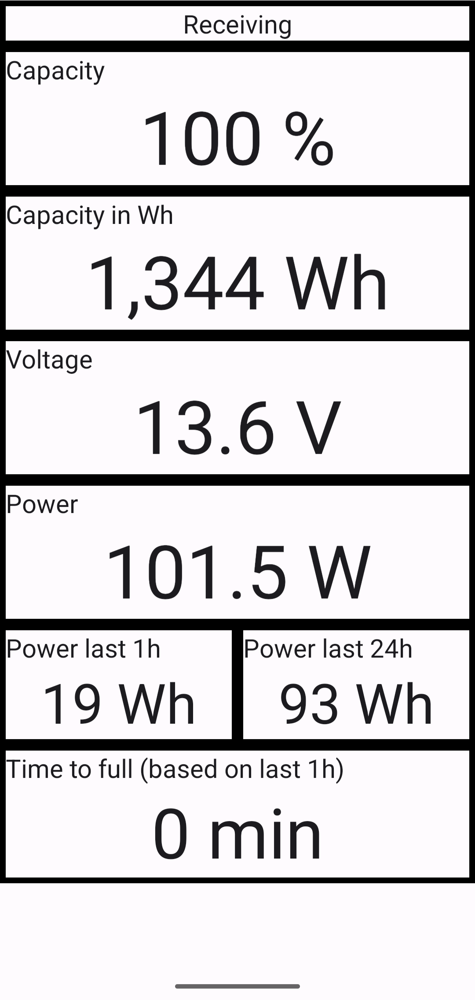

# bluetooth-shunt-android
Android application to monitor battery data sent by the [BLE ESP32 server](https://github.com/mhueck/bluetooth-shunt-esp32).

As anybody can easily see, I am no expert on Adnroid applications. This was mereley cobbled together from examples and then made somehow working.
But at this point the application is usable. 

The only known issue is that after loosing the bluetooth connection (moving out of range), the app does not automatically reconnect. You have to close and start again. 

And of course the "design" is very rudimentary - but functional.

## Installation

I did not provide an APK yet. It should build pretty easily with Android Studio and you can install from there.
